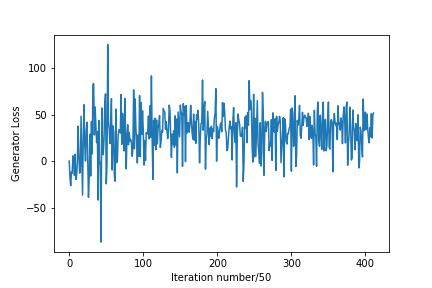

# Tensorflow-GAN-Faces
A [Wasserstein Generative Adversarial Network](https://arxiv.org/abs/1701.07875) for producing semi-realistic images of faces. The model uses WGAN loss with a gradient penalty. Written in Tensorflow 2.x The model was trained on [Labeled Faces in the Wild Dataset (LFW](http://vis-www.cs.umass.edu/lfw/)) at 50% scale (62 pixels by 47 pixels) in color. This dataset is very small for training a GAN, and was chosen for considerations of model size and runtime. For higher-qualty results, it is recommended to use significantly larger, like the Flicker-Faces-HQ dataset which contains 70,000 1024x1024 resolution images and takes ~90gb of space. 

The model was trained on a desktop computer running a Nvidia Geforce GTX 1080. Google Colaboratory offers more powerful TPU/GPUs to play around with, although they will the model run at some point, so I do not advise trying to hyperparameter tune on Colaboratory. 

See the Jupyter notebook for the code, or you can run the code on a GPU for free in Google Colab using this [collaboratory link](https://colab.research.google.com/github/rlronan/Tensorflow-GAN-Faces/blob/main/Tensorflow_WGAN_Faces.ipynb).

## Results
The top two rows in each photo show the generator's true outputs, and the bottom two rows show the generator's training-mode outputs (where batch norm and dropout are on). The discriminator model sees photos from the bottom two rows. With my custom generator penalty on, if the generator is doing well, it is punished according to how close its real sample images are to the average of those samples. 

Some of these images were also nearest-neighbor upsampled after generation to make them easier to view.

Semi-diverse results for final or near-final model:


 
 .
 


 
 .
 


 
 Results from various stages of model developement:
 
 

 
 
 
## Model Implementation
The hyperparameter tuning, and the model structure was weighted towards generating diverse samples, rather than the 'highest quality' samples. GANs are prone to 'mode collapse,' wherein the generator begins to produce almost identical samples on different input values. As this is especially likely on small datasets like the LFW dataset we use, we focus significantly on trying to minimize mode collapse, even though doing so sometimes comes at the cost of quality.

Mode collapsed earlier models:


The model uses [WGAN loss with a graident penalty](https://arxiv.org/abs/1704.00028) instead of gradient clipping. Additionally, a loss penalty I designed is added to the generator's loss to help prevent mode collapse and encourage diversity in produced images. 

The generator model uses 2D-Upsampling + Convolution instead of Deconvolution to produce and enlarge its images. Using deconvolution produces checkerboard artifacts in the generated images. See [this post](https://distill.pub/2016/deconv-checkerboard/) for original discovery of this issue, and suggested solution. 

Comparing generated images from untrained generators before and after we replace deconvolution with upsample + convolution below shows this effect.


The code for saving generated samples and model checkpoints to disk has been commented out so the code can be run on Google Colaboratory, but is marked as such and can easily be uncommmented if desired.

### WGAN Model Structure

Model Losses: 




Model Summary: 
```
Model: "generator"
_________________________________________________________________
Layer (type)                 Output Shape              Param #   
=================================================================
G_in (InputLayer)            [(None, 128)]             0         
_________________________________________________________________
G_1 (Dense)                  (None, 1536)              198144    
_________________________________________________________________
G_1_act (ReLU)               (None, 1536)              0         
_________________________________________________________________
G_reshape (Reshape)          (None, 4, 3, 128)         0         
_________________________________________________________________
G_2 (Conv2D)                 (None, 4, 3, 256)         819200    
_________________________________________________________________
2_up (UpSampling2D)          (None, 8, 6, 256)         0         
_________________________________________________________________
G_2_bn (BatchNormalization)  (None, 8, 6, 256)         1024      
_________________________________________________________________
G_2_act (ReLU)               (None, 8, 6, 256)         0         
_________________________________________________________________
spatial_dropout2d (SpatialDr (None, 8, 6, 256)         0         
_________________________________________________________________
G_3 (Conv2D)                 (None, 8, 6, 128)         819200    
_________________________________________________________________
3_up (UpSampling2D)          (None, 16, 12, 128)       0         
_________________________________________________________________
G_3_bn (BatchNormalization)  (None, 16, 12, 128)       512       
_________________________________________________________________
G_3_act (ReLU)               (None, 16, 12, 128)       0         
_________________________________________________________________
spatial_dropout2d_1 (Spatial (None, 16, 12, 128)       0         
_________________________________________________________________
G_4 (Conv2D)                 (None, 16, 12, 64)        204800    
_________________________________________________________________
4_up (UpSampling2D)          (None, 32, 24, 64)        0         
_________________________________________________________________
G_4_bn (BatchNormalization)  (None, 32, 24, 64)        256       
_________________________________________________________________
G_4_act (ReLU)               (None, 32, 24, 64)        0         
_________________________________________________________________
spatial_dropout2d_2 (Spatial (None, 32, 24, 64)        0         
_________________________________________________________________
G_5 (Conv2D)                 (None, 32, 24, 32)        51200     
_________________________________________________________________
5_up (UpSampling2D)          (None, 64, 48, 32)        0         
_________________________________________________________________
G_5_bn (BatchNormalization)  (None, 64, 48, 32)        128       
_________________________________________________________________
G_5_act (ReLU)               (None, 64, 48, 32)        0         
_________________________________________________________________
spatial_dropout2d_3 (Spatial (None, 64, 48, 32)        0         
_________________________________________________________________
G_6 (Conv2D)                 (None, 64, 48, 16)        12800     
_________________________________________________________________
G_6_act (ReLU)               (None, 64, 48, 16)        0         
_________________________________________________________________
G_7 (Conv2D)                 (None, 64, 48, 8)         3200      
_________________________________________________________________
G_7_act (ReLU)               (None, 64, 48, 8)         0         
_________________________________________________________________
G_8 (Conv2D)                 (None, 64, 48, 3)         600       
_________________________________________________________________
tf.image.resize_with_crop_or (None, 62, 47, 3)         0         
=================================================================
Total params: 2,111,064
Trainable params: 2,110,104
Non-trainable params: 960
_________________________________________________________________
Model: "discriminator"
_________________________________________________________________
Layer (type)                 Output Shape              Param #   
=================================================================
D_in (InputLayer)            [(None, 62, 47, 3)]       0         
_________________________________________________________________
D_1 (Conv2D)                 (None, 31, 24, 256)       19456     
_________________________________________________________________
D_1_act (LeakyReLU)          (None, 31, 24, 256)       0         
_________________________________________________________________
spatial_dropout2d_4 (Spatial (None, 31, 24, 256)       0         
_________________________________________________________________
D_2 (Conv2D)                 (None, 16, 12, 128)       819328    
_________________________________________________________________
D_2_act (LeakyReLU)          (None, 16, 12, 128)       0         
_________________________________________________________________
spatial_dropout2d_5 (Spatial (None, 16, 12, 128)       0         
_________________________________________________________________
D_3 (Conv2D)                 (None, 8, 6, 64)          204864    
_________________________________________________________________
D_3_act (LeakyReLU)          (None, 8, 6, 64)          0         
_________________________________________________________________
spatial_dropout2d_6 (Spatial (None, 8, 6, 64)          0         
_________________________________________________________________
D_4 (Conv2D)                 (None, 4, 3, 32)          51232     
_________________________________________________________________
D_4_act (LeakyReLU)          (None, 4, 3, 32)          0         
_________________________________________________________________
spatial_dropout2d_7 (Spatial (None, 4, 3, 32)          0         
_________________________________________________________________
flatten (Flatten)            (None, 384)               0         
_________________________________________________________________
D_5 (Dense)                  (None, 128)               49280     
_________________________________________________________________
D_6 (Dense)                  (None, 64)                8256      
_________________________________________________________________
D_7 (Dense)                  (None, 1)                 65        
=================================================================
Total params: 1,152,481
Trainable params: 1,152,481
Non-trainable params: 0
_________________________________________________________________
Batches per epoch: 103
WGAN:  True
Upsample_conv:  True
G_LR: 0.0001, D_LR: 0.0001
G_layers: [256, 128, 64, 32]
D_layers: [256, 128, 64, 32]
G_BN: True, D_BN: False
G_DROP: 0.45, D_DROP: 0.0
Lambda gp: 10
```
